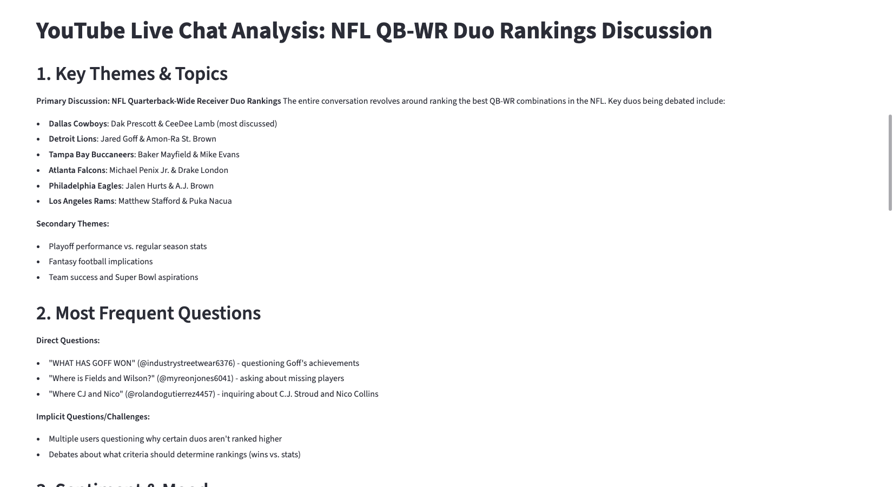

# 💬 YouTube Live Chat Analyzer

A powerful tool for content creators to analyze YouTube live chat messages and gain insights into audience engagement, sentiment, and trending topics using Claude AI.

---

## 🎯 Overview

This application helps YouTube creators understand their audience better by analyzing live chat data from their streams. Get instant insights about viewer questions, sentiment, engagement patterns, and community feedback to improve your content strategy.


---

## ✨ Key Features

### 🔍 **Multiple Data Collection Methods**
- **Live YouTube API**: Real-time chat data from active streams
- **Demo Mode**: Sample data for testing and exploration
- **Manual Input**: Analyze exported or custom chat data

### 🤖 **AI-Powered Analysis**
- **Comprehensive Analysis**: Complete overview of chat themes, sentiment, and engagement
- **Question Extraction**: Identify and categorize viewer questions
- **Sentiment Analysis**: Understand audience mood and reactions
- **Theme Detection**: Discover trending topics and recurring discussions

### 📊 **Rich Visualizations**
- Interactive charts showing top chatters
- Message timeline graphs
- Real-time statistics and metrics
- Exportable data in CSV format


---

## 🚀 Quick Start

### Prerequisites
- Python 3.8 or higher
- YouTube Data API key (optional)
- Anthropic Claude API key

### Installation

1. **Clone the repository**
   ```bash
   git clone <your-repository-url>
   cd youtube-chat-analyzer
   ```

2. **Install dependencies**
   ```bash
   pip install -r requirements.txt
   ```

3. **Set up environment variables**
   Create a `.env` file in the project root:
   ```env
   ANTHROPIC_API_KEY=your_claude_api_key_here
   YOUTUBE_API_KEY=your_youtube_api_key_here
   ```

4. **Run the application**
   ```bash
   streamlit run app.py
   ```


---

## 🔧 API Setup Guide

### 1. Getting Your Claude API Key

1. Visit [Anthropic Console](https://console.anthropic.com/)
2. Sign up or log in to your account
3. Navigate to API Keys section
4. Create a new API key
5. Copy and add to your `.env` file

### 2. Getting Your YouTube Data API Key

1. Go to [Google Cloud Console](https://console.cloud.google.com/)
2. Create a new project or select an existing one
3. Enable the YouTube Data API v3
4. Go to Credentials → Create Credentials → API Key
5. Copy and add to your `.env` file


---

## 📖 How to Use

### Method 1: Live YouTube Stream Analysis

1. **Select "YouTube API" from the sidebar**

2. **Enter a live stream URL**
   - Copy any active YouTube live stream URL
   - Paste it into the input field
   - Example: `https://www.youtube.com/watch?v=VIDEO_ID`

3. **Configure settings**
   - Set number of messages to collect (50-500)
   - Choose analysis type (comprehensive, questions, sentiment, themes)

4. **Click "Analyze Chat"**

5. **View results**
   - Real-time collection progress
   - Comprehensive statistics
   - AI-powered insights
   - Interactive visualizations


### Method 2: Demo Mode (No API Keys Required)

1. **Select "Demo Data" from sidebar**
2. **Set number of sample messages**
3. **Click "Run Demo Analysis"**
4. **Explore the interface with generated data**


### Method 3: Manual Input

1. **Select "Manual Entry" from sidebar**
2. **Paste your chat messages** in the format:
   ```
   Username1: This is a great stream!
   Username2: How do you do that?
   Username3: Amazing content!
   ```
3. **Click "Analyze These Messages"**


---

## 📊 Understanding the Results

### Basic Statistics Panel
- **Total Messages**: Number of chat messages analyzed
- **Unique Users**: Count of different chatters
- **Avg per User**: Average messages per participant
- **Avg Length**: Average character count per message



### Most Active Users Chart
Interactive bar chart showing your most engaged community members.


### Claude AI Analysis
Detailed insights based on your selected analysis type:

#### Comprehensive Analysis Example:
- Key discussion themes
- Frequently asked questions
- Overall sentiment and mood
- Notable community reactions
- Engagement patterns


#### Question Analysis Example:
- Categorized viewer questions
- Question frequency analysis
- Answered vs unanswered questions
- Question quality assessment


#### Sentiment Analysis Example:
- Overall emotional tone
- Engagement level assessment
- Community vibe analysis
- Mood shifts during stream


### Message Timeline
Line graph showing chat activity over time, helping identify peak engagement moments.


### Data Export
Download complete chat data as CSV for further analysis or record keeping.


---

## 🎯 Use Cases & Benefits

### For Content Creators
- **Audience Insights**: Understand what your viewers care about most
- **Content Optimization**: Identify topics that generate the most engagement
- **Q&A Preparation**: Extract common questions for future FAQ sessions
- **Community Health**: Monitor sentiment and address concerns proactively

### For Marketing Teams
- **Campaign Analysis**: Measure audience reaction to product launches
- **Trend Identification**: Spot emerging topics and interests
- **Engagement Metrics**: Track community participation levels
- **Feedback Collection**: Gather real-time audience opinions

### For Researchers
- **Social Media Analysis**: Study online community behavior
- **Sentiment Tracking**: Monitor public opinion on topics
- **Conversation Analysis**: Understand discussion patterns
- **Data Collection**: Export structured chat data for further research


---

## ⚙️ Technical Details

### Architecture
```
├── app.py                 # Main Streamlit application
├── requirements.txt       # Python dependencies
├── .env                  # API keys (create this file)
└── README.md            # This documentation
```

### Dependencies
- **Streamlit**: Web interface framework
- **Requests**: HTTP client for API calls
- **Pandas**: Data manipulation and analysis
- **Plotly**: Interactive visualizations
- **Python-dotenv**: Environment variable management

### API Limits & Costs
- **YouTube Data API**: 10,000 quota units/day (free tier)
- **Claude API**: Pay-per-use pricing (check Anthropic pricing)
- **Rate Limiting**: Built-in delays to respect API limits

---

## 🛠️ Troubleshooting

### Common Issues

#### "Need Claude API key in .env file"
- Ensure your `.env` file exists in the project root
- Check that `ANTHROPIC_API_KEY` is spelled correctly
- Verify your API key is valid and active


#### "Couldn't get any messages"
- Verify the stream is currently live
- Check that chat is enabled on the stream
- Ensure the video is public (not private/unlisted)
- Try with a different live stream


#### "API returned 404" Error
- Your Claude API key might not have access to the model
- Try using demo mode to test the interface
- Check Anthropic console for account status

#### YouTube API Quota Exceeded
- Wait for quota reset (daily limit)
- Use demo mode or manual input as alternatives
- Consider upgrading to paid Google Cloud plan

### Getting Help
1. Check the troubleshooting section above
2. Try demo mode to isolate API issues
3. Verify all API keys are correctly set up
4. Ensure you're using a currently live stream

---

## 🔮 Future Enhancements

### Planned Features
- **Real-time Dashboard**: Live updating analytics during streams
- **Historical Analysis**: Compare chat patterns across multiple streams
- **Automated Insights**: Scheduled analysis reports
- **Multi-language Support**: Analysis in different languages
- **Advanced Filtering**: Filter by user type, message length, timeframe
- **Export Options**: PDF reports, JSON data export

### Integration Possibilities
- **OBS Plugin**: Display chat insights directly in streaming software
- **Discord Bot**: Share insights automatically in Discord servers
- **Twitter Integration**: Post key insights as tweets
- **Analytics Platforms**: Connect with Google Analytics or similar tools
---

## 🤝 Contributing

1. Fork the repository
2. Create your feature branch (`git checkout -b feature/AmazingFeature`)
3. Commit your changes (`git commit -m 'Add some AmazingFeature'`)
4. Push to the branch (`git push origin feature/AmazingFeature`)
5. Open a Pull Request

---

## ⭐ Acknowledgments

- Built with [Streamlit](https://streamlit.io/)
- Powered by [Anthropic Claude](https://www.anthropic.com/)
- YouTube data via [YouTube Data API v3](https://developers.google.com/youtube/v3)
- Visualizations by [Plotly](https://plotly.com/)


---

*Made with ❤️ for the YouTube creator community*
